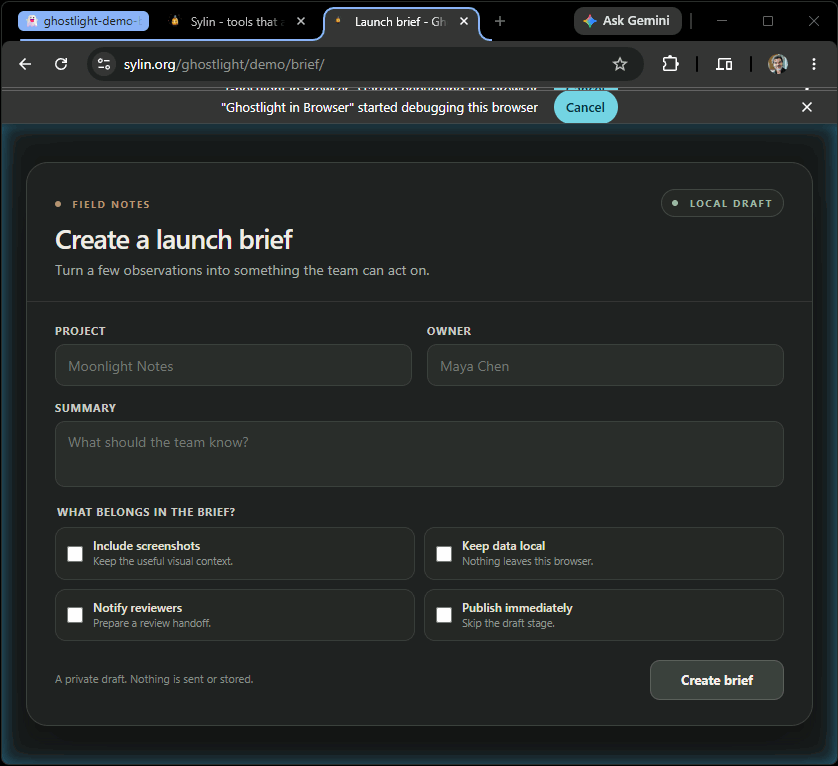

<p align="center">
  
</p>

<h1 align="center">Ghostlight</h1>

<p align="center"><strong>Governed access to your own browser, for AI agents.</strong></p>

<p align="center">
  <a href="https://github.com/sylin-org/ghostlight/actions/workflows/ci.yml"></a>
  <a href="https://www.npmjs.com/package/ghostlight"></a>
  <a href="https://github.com/sylin-org/ghostlight/releases/latest"></a>
</p>

Let your AI agent use *your* browser -- the real one, with your logins, your tabs, your
sessions -- from any MCP client (Claude Code, Cursor, VS Code, Zed, Cline, and anything else
that speaks MCP). Governed when you want it, wide open when you don't.

<!-- HERO DEMO SLOT: an annotated session GIF recorded by Ghostlight's own gif_creator tool
     (sky-blue click rings, action labels, progress bar, watermark). Capture with
     scripts/capture-readme-tour.ps1, keep it under ~5 MB, then:
<p align="center"></p>
<p align="center"><sub>This demo was recorded by Ghostlight itself, with its gif_creator tool.</sub></p>
-->

## Install in two minutes

You need a Chromium browser (Chrome, Edge, Brave, or Chromium, 116+) and an MCP client.
No Node, no Rust, no runtime dependencies -- the npm launcher just fetches one portable binary.

Add Ghostlight to any MCP client as a stdio server:

```json
{ "command": "npx", "args": ["-y", "ghostlight"] }
```

```sh
# Claude Code
claude mcp add ghostlight -- npx -y ghostlight
```

[](cursor://anysphere.cursor-deeplink/mcp/install?name=ghostlight&config=eyJjb21tYW5kIjoibnB4IiwiYXJncyI6WyIteSIsImdob3N0bGlnaHQiXX0=)
[](vscode:mcp/install?%7B%22name%22%3A%22ghostlight%22%2C%22command%22%3A%22npx%22%2C%22args%22%3A%5B%22-y%22%2C%22ghostlight%22%5D%7D)

Then connect the browser side (once) and verify:

```sh
npx ghostlight install    # registers the browser connection + your MCP clients (idempotent)
npx ghostlight doctor     # tells you exactly what is healthy and what is not
```

Finally, add the **"Ghostlight in Browser"** extension: download `ghostlight-extension-v*.zip`
from the [latest release](https://github.com/sylin-org/ghostlight/releases/latest) and load it
unpacked at `chrome://extensions` (a Chrome Web Store listing is on the way). Restart your MCP
client, and the browser tools appear.

Prefer a shell one-liner, prebuilt archives, or building from source? Every path is covered in
the [install guide](https://sylin-org.github.io/ghostlight/install.html), and the manual route is
below.

<details>
<summary><strong>Manual install (inspect everything)</strong></summary>

1. **Get the binary.** Download a prebuilt archive from the
   [Releases page](https://github.com/sylin-org/ghostlight/releases/latest) (each carries a
   SHA-256 checksum and a signed build-provenance attestation:
   `gh attestation verify <archive> --repo sylin-org/ghostlight`), or build from source with a
   stable Rust toolchain: `cargo build --release`. The build produces two executables:
   `ghostlight` (the CLI) and the thin `ghostlight-relay` pass-through your MCP client and
   Chrome launch.
2. **Load the extension.** `chrome://extensions` -> Developer mode -> Load unpacked -> the
   `extension/` directory. The committed manifest key pins the extension ID, and the installer
   already allows it -- nothing to copy.
3. **Register.** `./target/release/ghostlight install`. Useful flags: `--dry-run` (print the
   plan, write nothing), `--browser <id>` / `--client <id>` (limit scope; repeatable),
   `--all-browsers` / `--all-clients`, `--debug` (observability on), `--system` (machine-wide).
   The installer is an idempotent value-level merge; it never clobbers your config and never
   duplicates entries.
4. **Restart the client, reload the extension, run `ghostlight doctor`.** A healthy result
   reports registration, a live endpoint, and a connected extension; anything off gets a
   specific, actionable finding.

</details>

## Why Ghostlight

- **Bring your own agent.** It speaks MCP, so it works with any client -- including Claude via
  Bedrock or Vertex. You are not locked into one vendor's app or cloud.
- **Your session, not a clean-room browser.** The value is your authenticated context: real
  cookies, real SSO, real tabs. Your work never gets relocated to a cloud browser or a fresh
  profile to gain a technical property.
- **Governance fused with the engine, not bolted on.** Capability classification, access
  decisions, and audit live at one dispatch chokepoint in the binary. A governed client only
  sees the tools its grants permit; every call is checked and recorded. And all-open is a
  first-class mode, not a degraded one.
- **A single portable binary, zero runtime dependencies.** No servers to babysit; the class of
  install failures that plagues Node-based browser MCPs does not exist here.

## Watch it work

Every action the agent takes is visible in the browser: sky-blue click ripples, a comet trail
on drags, a shimmer while it types, captions narrating each step. The agent works inside its own
tab group (labeled 👻Ghostlight), visually separate from your tabs, and you can grab the wheel --
or hit the kill switch -- at any moment. The agent can even hand you a souvenir: `gif_creator`
records the session and exports an annotated animated GIF, made by the same pipeline that renders
the overlays.

## What the agent can do

A typical first request:

> Open a new browser tab, go to example.com, and tell me what the page says.

The tool surface preserves the schemas Claude was trained on, byte for byte, and adds more on
top -- 21 tools in five groups:

- **See and act.** Navigate, click, type, scroll, hover, drag; screenshots with exact coordinate
  mapping and an on-page cursor.
- **Forms and files.** Fill forms by element ref or semantically by label (shadow DOM included);
  upload file bytes or captured screenshots straight into page inputs and drop targets.
- **Compose.** Multi-step scripts with inter-step data flow and `dry_run` pre-flight; one-call
  action batches; wait-for-condition with page settlement.
- **Record.** Animated-GIF session recording with click cues, action labels, a progress bar, and
  real per-frame timing.
- **Inspect.** Accessibility tree (with diff mode), page text, element search, console and
  network activity, and consequence digests on mutating actions.

Ask the agent to call `explain` at any time for the authoritative, in-session directory of every
action and the capability it requires.

<details>
<summary><strong>The full tool table</strong></summary>

| Tool                    | What it does                                     | Capability                 |
| ----------------------- | ------------------------------------------------ | -------------------------- |
| `navigate`              | Go to a URL, or forward/back in history          | read                       |
| `computer`              | Mouse, keyboard, and screenshots (13 actions)    | read or action, per action |
| `read_page`             | Accessibility-tree view of the page              | read                       |
| `get_page_text`         | Visible text extraction                          | read                       |
| `find`                  | Locate elements on the page                      | read                       |
| `form_input`            | Fill form fields, including shadow DOM           | write                      |
| `javascript_tool`       | Run JavaScript in the page context               | execute                    |
| `tabs_context_mcp`      | List tabs in the MCP tab group                   | read                       |
| `tabs_create_mcp`       | Create a tab in the MCP tab group                | none                       |
| `read_console_messages` | Recent console output                            | read                       |
| `read_network_requests` | Recent network activity                          | read                       |
| `resize_window`         | Resize the browser window                        | none                       |
| `update_plan`           | Record the agent's working plan                  | none                       |
| `wait_for`              | Wait for a page condition and settlement         | read                       |
| `script`                | Run a sequence of tool calls in one request (with optional `dry_run`) | none |
| `form_fill`             | Fill a form by field labels in one call          | read + write (or read + write + action when `submit: true`) |
| `file_upload`           | Upload file bytes to a file `<input>` on the page | write                     |
| `browser_batch`         | Run a batch of browser actions in one call       | none                       |
| `upload_image`          | Place a captured screenshot into a file input or drop target | write          |
| `gif_creator`           | Record a session and export it as an animated GIF | read or write, per action |
| `explain`               | List every action and the capability it requires | none                       |

For `computer`, the read-only actions (`screenshot`, `scroll`, `zoom`, `scroll_to`, `hover`)
require `read`, the input actions (`left_click`, `right_click`, `type`, `key`,
`left_click_drag`, `double_click`, `triple_click`) require `action`, and `wait` requires none.

</details>

## Governed, honestly

Governance is off by default and turns on when a policy manifest is present. A manifest grants
capabilities -- `read`, `action`, `write`, `execute` -- to an identity on the hosts you name, with
`deny` carve-outs, and every call resolves against it at a single chokepoint:

```json
{
  "schema": 3,
  "name": "acme-dev",
  "version": "2026.07.0",
  "identity": { "resolved_by": "local_file", "principal": "dev@acme" },
  "grants": [
    { "id": "acme-apps",
      "hosts": { "allow": ["*.acme.com"], "deny": ["payroll.acme.com"] },
      "allowed": ["read", "action", "write"] }
  ],
  "config": [
    { "key": "content.security.sacred_domains", "value": ["*.mybank.com"], "level": "mandatory" }
  ]
}
```

(That exact file renders as plain sentences with `ghostlight policy explain` -- try it.)

- **Capabilities, not tool lists.** Every action carries an intrinsic classification. The
  vocabulary is published as an open, vendor-neutral spec: the
  [RAWX capability model](open-spec/rawx-capability-model.md) (`rwx` for agents).
- **Observe before you enforce.** `observe` mode dispatches everything and records what enforce
  *would have* denied; `enforce` blocks. Sacred never-touch domains always enforce.
- **Evidence built in.** Every call -- permitted, denied, or shadow-denied -- emits one structured
  JSON-Lines audit record: identity, host, capability, grant, decision, duration. Stream to a
  file, stderr, or syslog for your SIEM ([guide](docs/guides/siem-integration.md)).
- **Live and layered.** Manifests hot-reload without a restart (failing closed on a bad edit);
  configuration resolves through defaults, org policy, and user layers, with org locks.

A governed client only *sees* the tools its grants permit, plus `explain`. Start from a ready
manifest in [`examples/`](examples/), preview any file with `ghostlight policy explain <file>`,
and see the [solo-developer](docs/guides/solo-developer.md) and
[compliance-team](docs/guides/compliance-team.md) guides for the full journey.

## How it works

```
MCP Client  --stdio-->  Rust Binary  --native messaging-->  Extension  --CDP-->  Browser
 (agent)                (engine +      (4-byte framed)      (thin CDP           (your real
                         governance)                         executor)           session)
```

Three processes, two protocol boundaries. The binary is both the MCP server and the browser's
native-messaging host; the extension is deliberately thin -- it holds only what must touch a
Chrome API, and no policy at all. Windows, macOS, and Linux build and pass the full suite in CI;
end-to-end browser use is verified on Windows.

<details>
<summary><strong>CLI and troubleshooting</strong></summary>

- No subcommand: the MCP server role (your client launches this; you do not run it by hand).
- `install` / `uninstall`: register or remove everything (both support `--dry-run`).
- `doctor [--verbose]`: read-only diagnosis of the whole chain with a truthful exit code.
- `status [--json]`: a running server's live inner state (requires `--debug` /
  `GHOSTLIGHT_DEBUG=1`).
- `config <list|get|set|schema|docs|preset>`: the layered configuration, with sources and locks.
- `policy <explain|simulate|init>`: render a manifest as plain sentences, replay an audit log
  against a candidate policy, or write a starter manifest.

**If something is off, start with `doctor`** -- it pinpoints unregistered browsers/clients, a
missing server, a stale endpoint, or an extension that never connected. Extension shows
disconnected? Reload it at `chrome://extensions`. Rebuilding on Windows? Stop the MCP client
first; a running server locks the exe.

</details>

## Roadmap

Chrome Web Store listing (installs without developer mode), live browser verification on macOS
and Linux, an `http` audit destination and offline license keys for organizations, `managed://`
policy distribution for MDM/Group Policy fleets -- and more adapters on the same governance
spine, because the browser is the first, not the last. The durable asset is the
[RAWX capability model](open-spec/rawx-capability-model.md); mechanisms change.

## Documentation

| Doc                                                                 | What it is                                                              |
| ------------------------------------------------------------------- | ------------------------------------------------------------------------ |
| [docs/guides/solo-developer.md](docs/guides/solo-developer.md)      | Ten minutes from clone to a working agent, plus personal safety rails.   |
| [docs/guides/compliance-team.md](docs/guides/compliance-team.md)    | Taking a policy from blank page to org-wide enforcement, with evidence.  |
| [docs/guides/siem-integration.md](docs/guides/siem-integration.md)  | Audit stream schema and Splunk / Sentinel / Elastic ingestion.           |
| [docs/COMPARISON.md](docs/COMPARISON.md)                            | How Ghostlight compares to the alternatives, honestly.                   |
| [PRICING.md](PRICING.md)                                            | Editions, the founding program, and the Continuity Promise.              |
| [CONTRIBUTING.md](CONTRIBUTING.md)                                  | How to ask questions, request features, and contribute code.             |
| [SECURITY.md](SECURITY.md)                                          | Vulnerability reporting and what to expect.                              |
| [docs/SPEC.md](docs/SPEC.md)                                        | The authoritative design specification.                                  |
| [docs/adr/](docs/adr/)                                              | Architecture Decision Records: why the design is the way it is.          |
| [open-spec/](open-spec/)                                            | Open specs we publish for the ecosystem (starts with RAWX).              |

## Positioning

Ghostlight preserves the tool schemas Claude was trained on, byte for byte, so a trained agent
behaves as expected; everything behind them is an original, clean-room Rust implementation.
Anthropic ships a first-party Claude Code + Chrome integration, and it is good --
[docs/COMPARISON.md](docs/COMPARISON.md) tells you honestly when that path (or another) is the
better choice. Ghostlight is for everyone those paths exclude: other MCP clients, Claude via
cloud providers, and anyone who wants policy as code, an audit trail, or a self-hosted stack.

Ghostlight is the first of a planned family of governance-friendly MCP tools; the theatrical
ghost light -- the lamp left burning so the theater is never dark -- is the
[name behind it](docs/adr/0021-ghostlight-brand-and-family.md).

## Questions, requests, and contributing

[GitHub Issues](../../issues) for bugs, [GitHub Discussions](../../discussions) for questions and
ideas, and hello@sylin.org for anything that cannot be public. Every request gets a disposition
with reasoning -- accepted, deferred, or declined against the project's recorded vision. See
[CONTRIBUTING.md](CONTRIBUTING.md).

## License

Ghostlight is open-core. The engine -- everything outside `src/governance/` -- is open source
under Apache-2.0 OR MIT, at your option. The governance module (`src/governance/`) is
source-available under the Ghostlight Commercial License, and free for almost everyone:
individuals and solo developers, teams of up to five, evaluation and development at any org
size, all-open operation at any org size, and noncommercial nonprofit/open-source use. Exactly
one situation needs a commercial subscription: an organization of more than five people running
the governance features operationally. See [LICENSING.md](LICENSING.md) for the plain-language
guide.

Editions, prices, the founding program (12 months free for the first ten organizations), and
the Continuity Promise -- license state never affects behavior, and the binary never phones
home -- are in [PRICING.md](PRICING.md).
